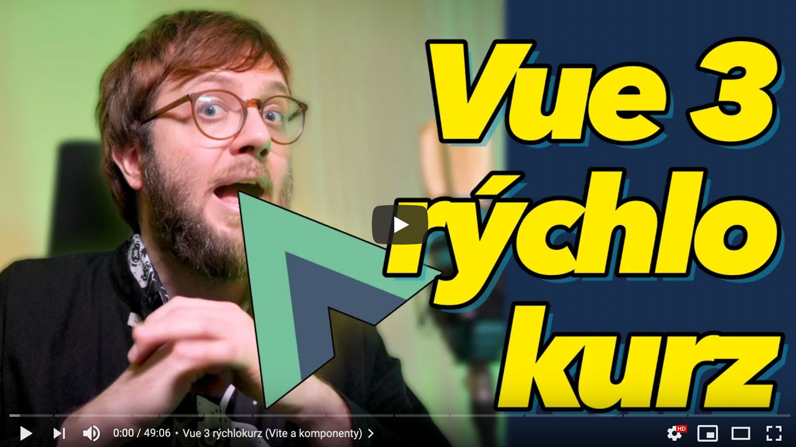

# Vue 3 rýchlokurz ✨ programovanie cez komponenty  

**Naučím ťa Vue 3.** Na malej appke ťa naučím základy Vue 3, komponentov a ich komunikácie. Ukážem pár Vue 2 vs 3 rozdielov, eventHub cez mitt, nový Vite dev server. Na frontend pohovoroch často chcú programovanie cez komponenty. Tak čum. Nech vieš. V ďalšom kurze vysvetlím **Vue 3 Composition API**.  
  
Ak sa ti kurz páči, hoď po mne peniaz cez patreon ♥️ https://www.patreon.com/yablko.  
Dostaneš ďalšie kurzy skôr. Aj v textovej forme.  

---

### Vue 3 kurz ✨ programovanie cez komponenty  
:: https://youtu.be/AJ17T-miRII

---

Vue 3 + Vite  
:: https://v3.vuejs.org  
:: https://github.com/vitejs/vite  
:: https://v3.vuejs.org/guide/installation.html#vite  

Vetur  
:: https://marketplace.visualstudio.com/items?itemName=octref.vetur

Vue VSCode Snippets  
:: https://marketplace.visualstudio.com/items?itemName=sdras.vue-vscode-snippets

JavaScript (ES6) code snippets  
:: https://marketplace.visualstudio.com/items?itemName=xabikos.JavaScriptSnippets

Vue 3 Event Bus  
:: https://v3.vuejs.org/guide/migration/events-api.html#_2-x-syntax

Mitt  
:: https://github.com/developit/mitt

Vuex  
:: https://vuex.vuejs.org

---

❤️ PATREON https://patreon.com/yablko  
🎬 YOUTUBE 2 https://youtube.com/yablko  
🍿 TWITCH https://twitch.com/yablko_  
📸 INSTAGRAM https://instagram.com/yablko  
👍 FACEBOOK https://www.facebook.com/yablko.smrdi  
🐦 TWITTER https://twitter.com/yablko  
📚 BLOGY https://medium.com/@yablko  
  
📚 Všetky moje learn2code kurzy  
:: https://www.learn2code.sk/instruktori/roman-hraska 1300+ videí
